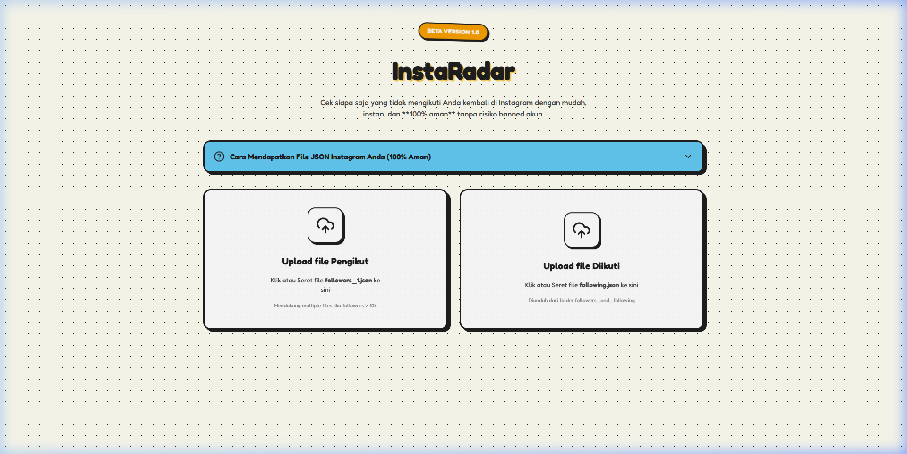
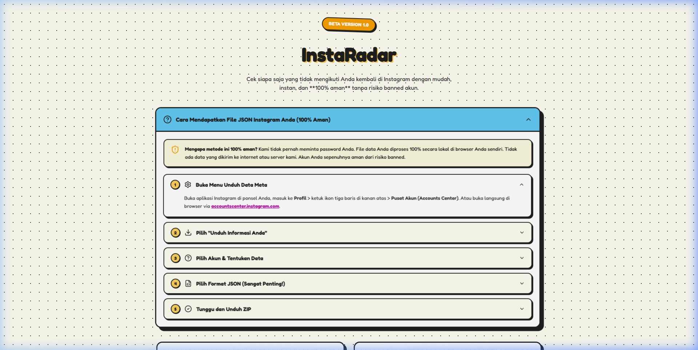
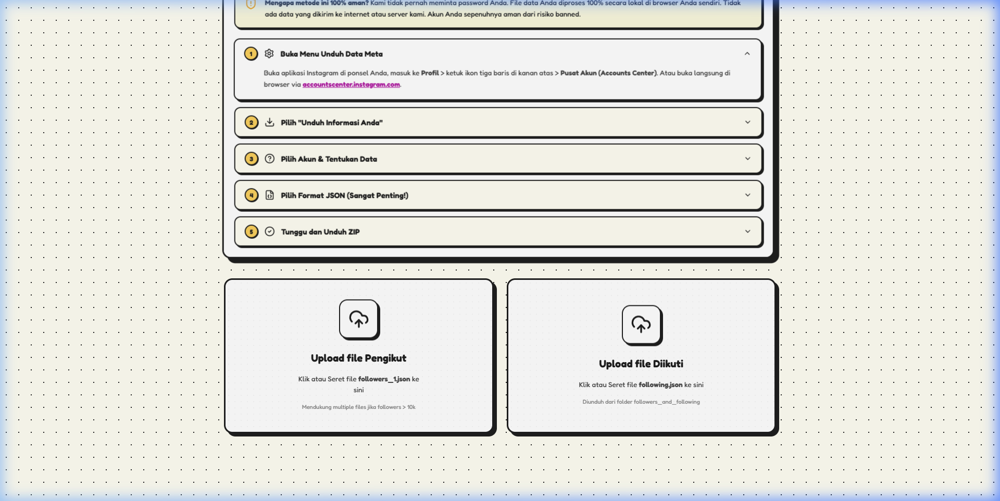
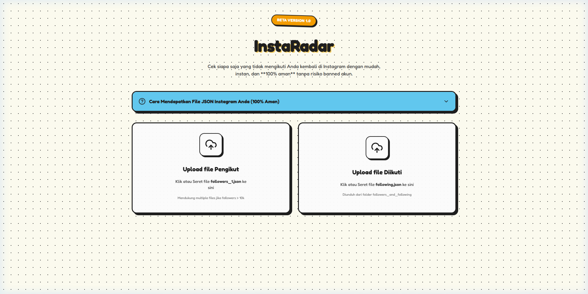

# 🛰️ InstaRadar — Premium Instagram Unfollower Checker

<p align="center">
  
  
  
  
  
</p>

---

**InstaRadar** adalah website analisis pengikut Instagram premium yang dirancang khusus dengan mengutamakan **keamanan akun 100%** dan **estetika visual**. 

Aplikasi ini menggunakan pendekatan **100% Client-Side Parsing**, artinya seluruh data file JSON resmi dari Meta Instagram Anda dibaca langsung dan dianalisis secara lokal di browser komputer Anda tanpa pernah dikirim ke server internet mana pun. **Tidak perlu login, tidak perlu memasukkan password, bebas dari risiko banned atau checkpoint!**

### 🔗 [Coba Demo Live Sekarang di Vercel!](https://cek-unfoll-ig.vercel.app/)

## ✨ Fitur Unggulan

* 🛡️ **Aman 100% (Tanpa Login Password)**: Menggunakan file resmi `followers_1.json` dan `following.json` hasil unduhan resmi Anda di Meta Accounts Center.
* 📊 **Dashboard Analisis & Rasio Interaktif**: Grafik persentase lingkaran chunky gradasi (Circular SVG Diagram) yang menghitung perbandingan pengikut Anda.
* 👥 **Pembagian Kategori Akun Akurat**:
  * **Tidak Follback (Unfollowers)**: Akun yang Anda ikuti, tapi mereka tidak mengikuti Anda balik.
  * **Saling Mengikuti (Mutuals)**: Teman akrab yang saling mengikuti.
  * **Fans Anda**: Akun yang mengikuti Anda, tapi belum Anda ikuti balik.
* ⭐ **Sistem Whitelist Persisten**: Tandai akun selebriti, publik figur, atau portal berita terfavorit Anda dengan tombol Bintang (⭐) agar mereka disembunyikan dari daftar Unfoll. Data tersimpan aman di `localStorage` browser Anda.
* 🔍 **Pencarian Instan & Sorting**: Kolom pelacak username secara real-time dengan filter urutan abjad atau waktu.
* 💾 **Aksi Ekspor Cepat**: Salin daftar akun ke clipboard dengan sekali tekan atau unduh tabel lengkap berformat **CSV**.
* 🌐 **Akses Profil Langsung**: Tombol tautan cepat untuk membuka profil Instagram target di tab baru guna mempermudah proses unfollow manual.

---

## 📸 Tampilan Antarmuka (Screenshots)

### 1. Landing Page Utama (Initial Page Load)
Desain visual Neobrutalism yang memikat dengan lencana komik berputar serta dropzone drag-and-drop file JSON yang interaktif.



### 2. Panduan Langkah Mengunduh Data Instagram (Interactive Guide)
Accordion panduan visual beranimasi komik yang memandu pengguna secara aman untuk mendapatkan file JSON resmi dari Meta dalam 5 menit.



### 3. Area Unggah File JSON (Uploader Cards)
Antarmuka upload yang cerdas dilengkapi deteksi file berhasil dan sistem parser otomatis yang sangat tangguh terhadap berbagai versi pembaruan JSON Instagram.



### 4. Hasil Analisis Live di Vercel
Dashboard statistik interaktif lengkap dengan kategori rasio, pencarian real-time, whitelist bintang, dan opsi ekspor.



---

## ⚙️ Cara Menjalankan Secara Lokal (Local Development)

Jika Anda ingin menjalankan atau memodifikasi website ini di komputer Anda sendiri:

1. **Clone Repositori**:
   ```bash
   git clone https://github.com/maulaknatt/InstaRadar.git
   cd InstaRadar
   ```

2. **Instal Dependensi**:
   ```bash
   npm install
   ```

3. **Jalankan Mode Pengembangan (Local Dev Server)**:
   ```bash
   npm run dev
   ```
   Buka browser Anda dan akses tautan **`http://localhost:5173/`**.

4. **Build untuk Produksi**:
   ```bash
   npm run build
   ```

---

## 🛡️ Jaminan Privasi & Keamanan (Security Declaration)

Website ini **TIDAK MENGGUNAKAN BACKEND ATAU DATABASE**. 
* Seluruh operasi membaca file JSON dan mencocokkan data relasi menggunakan algoritma javascript murni yang berjalan lokal di sisi klien browser (*client-side execution*). 
* Tidak ada data username, riwayat, atau file Anda yang diunggah ke server mana pun di internet. Data Anda sepenuhnya milik Anda sendiri!

---

## 📝 Lisensi

Proyek ini dilindungi oleh lisensi **MIT**. Silakan gunakan, pelajari, dan kembangkan secara bebas!

---
<p align="center">Dibuat dengan 💖 dan garis hitam tebal oleh <b>InstaRadar Team</b></p>
